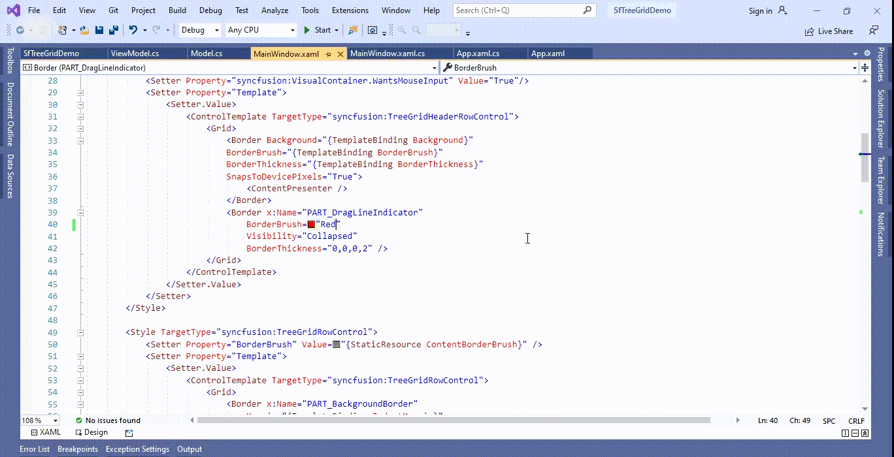
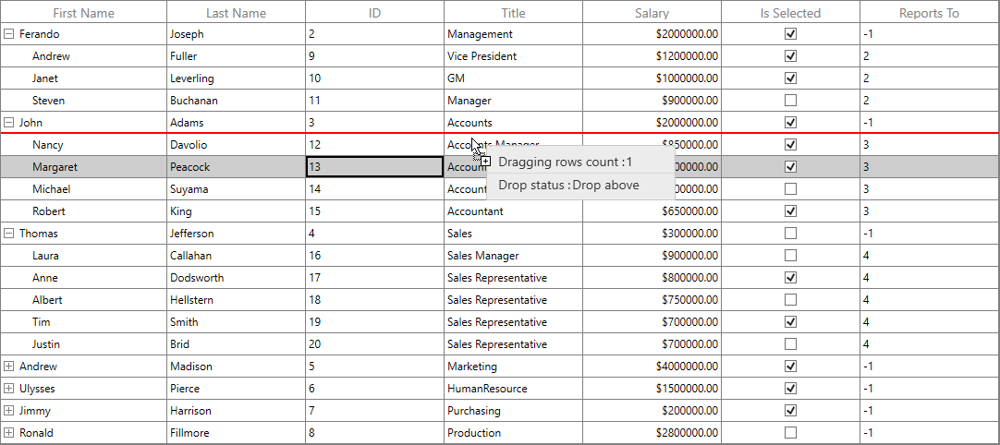

# How to change the color of drag line indicator in WPF TreeGrid (SfTreeGrid)?

## About the sample
This example illustrates how to change the color of drag line indicator in WPF TreeGrid (SfTreeGrid)

By default, [SfTreeGrid](https://help.syncfusion.com/cr/wpf/Syncfusion.UI.Xaml.TreeGrid.SfTreeGrid.html) does not provide the direct support to change the color of drag line indicator. You can change the color of drag line indicator by overriding the [TreeGridHeaderRowControl](https://help.syncfusion.com/cr/wpf/Syncfusion.UI.Xaml.TreeGrid.TreeGridHeaderRowControl.html) and [TreeGridRowControl](https://help.syncfusion.com/cr/wpf/Syncfusion.UI.Xaml.TreeGrid.TreeGridRowControl.html) Template in [SfTreeGrid](https://help.syncfusion.com/cr/wpf/Syncfusion.UI.Xaml.TreeGrid.SfTreeGrid.html).

```XML

<LinearGradientBrush x:Key="HeaderBackgroundBrush" StartPoint="0,0" EndPoint="1,1" >
            <GradientStop Color="Transparent" Offset="0" />
            <GradientStop Color="Transparent" Offset="1" />
</LinearGradientBrush>
<SolidColorBrush x:Key="HeaderBorderBrush" Color="Gray" />
<SolidColorBrush x:Key="ContentBorderBrush" Color="Gray" />

<Style TargetType="syncfusion:TreeGridHeaderRowControl">
            <Setter Property="Background" Value="{StaticResource HeaderBackgroundBrush}" />
            <Setter Property="BorderBrush" Value="{StaticResource HeaderBorderBrush}" />
            <Setter Property="BorderThickness" Value="0" />
            <Setter Property="IsTabStop" Value="False" />
            <Setter Property="syncfusion:VisualContainer.WantsMouseInput" Value="True"/>
            <Setter Property="Template">
                <Setter.Value>
                    <ControlTemplate TargetType="syncfusion:TreeGridHeaderRowControl">
                        <Grid>
                            <Border Background="{TemplateBinding Background}"
                            BorderBrush="{TemplateBinding BorderBrush}"
                            BorderThickness="{TemplateBinding BorderThickness}"
                            SnapsToDevicePixels="True">
                                <ContentPresenter />
                            </Border>
                            <Border x:Name="PART_DragLineIndicator" 
                                BorderBrush="Red" 
                                Visibility="Collapsed" 
                                BorderThickness="0,0,0,2" />
                        </Grid>
                    </ControlTemplate>
                </Setter.Value>
            </Setter>
</Style>

<Style TargetType="syncfusion:TreeGridRowControl">
            <Setter Property="BorderBrush" Value="{StaticResource ContentBorderBrush}" />
            <Setter Property="Template">
                <Setter.Value>
                    <ControlTemplate TargetType="syncfusion:TreeGridRowControl">
                        <Grid>
                            <Border x:Name="PART_BackgroundBorder"
                                Margin="{TemplateBinding IndentMargin}"
                                Background="{TemplateBinding Background}"
                                Visibility="Visible">
                                <Rectangle x:Name="PART_FocusRect"
                                       Margin="1,2,2,2"
                                       Fill="Transparent"
                                       Stroke="DarkGray"
                                       StrokeDashArray="2,2"
                                       StrokeThickness="1"
                                       Visibility="Collapsed" />
                            </Border>
                            <Border x:Name="PART_SelectionBorder"
                                Margin="{TemplateBinding IndentMargin}"
                                Background="{TemplateBinding SelectionBackground}"
                                Visibility="Collapsed" />
                            <ContentPresenter />
                            <Border x:Name="PART_DragLineIndicator" 
                                BorderBrush="Red" 
                                Visibility="Collapsed" 
                                BorderThickness="0,0,0,2" />
                            <VisualStateManager.VisualStateGroups>
                                <VisualStateGroup x:Name="SelectionStates">
                                    <VisualState x:Name="Unselected" />
                                    <VisualState x:Name="Selected">
                                        <Storyboard>
                                            <ObjectAnimationUsingKeyFrames BeginTime="00:00:00"
                                                                       Storyboard.TargetName="PART_SelectionBorder"
                                                                       Storyboard.TargetProperty="(UIElement.Visibility)">
                                                <DiscreteObjectKeyFrame KeyTime="00:00:00" Value="{x:Static Visibility.Visible}" />
                                            </ObjectAnimationUsingKeyFrames>
                                        </Storyboard>
                                    </VisualState>
                                    <VisualState x:Name="SelectedPointerOver">
                                        <Storyboard>
                                            <ObjectAnimationUsingKeyFrames BeginTime="00:00:00"
                                                                       Storyboard.TargetName="PART_SelectionBorder"
                                                                       Storyboard.TargetProperty="(UIElement.Visibility)">
                                                <DiscreteObjectKeyFrame KeyTime="00:00:00" Value="{x:Static Visibility.Visible}" />
                                            </ObjectAnimationUsingKeyFrames>
                                        </Storyboard>
                                    </VisualState>
                                    <VisualState x:Name="SelectedPressed">
                                        <Storyboard>
                                            <ObjectAnimationUsingKeyFrames BeginTime="00:00:00"
                                                                       Storyboard.TargetName="PART_SelectionBorder"
                                                                       Storyboard.TargetProperty="(UIElement.Visibility)">
                                                <DiscreteObjectKeyFrame KeyTime="00:00:00" Value="{x:Static Visibility.Visible}" />
                                            </ObjectAnimationUsingKeyFrames>
                                        </Storyboard>
                                    </VisualState>

                                    <VisualState x:Name="UnselectedPointerOver" />
                                    <VisualState x:Name="UnselectedPressed" />
                                    <VisualState x:Name="Focused">
                                        <Storyboard>
                                            <ObjectAnimationUsingKeyFrames BeginTime="00:00:00"
                                                                       Storyboard.TargetName="PART_FocusRect"
                                                                       Storyboard.TargetProperty="(UIElement.Visibility)">
                                                <DiscreteObjectKeyFrame KeyTime="00:00:00" Value="{x:Static Visibility.Visible}" />
                                            </ObjectAnimationUsingKeyFrames>
                                        </Storyboard>

                                    </VisualState>
                                </VisualStateGroup>
                            </VisualStateManager.VisualStateGroups>
                        </Grid>
                    </ControlTemplate>
                </Setter.Value>
            </Setter>
</Style>

```



The following screenshot shows the drag line indicator color changed,



KB article - [How to change the color of drag line indicator in WPF TreeGrid (SfTreeGrid)?](https://www.syncfusion.com/kb/12284/how-to-change-the-color-of-drag-line-indicator-in-wpf-treegrid-sftreegrid)

## Requirements to run the demo
Visual Studio 2015 and above versions


